<h1>Rest-Full-Control</h1>

<h2>🔗 Tópicos</h2>
<ul>
<li><a href="#about">Sobre</a></li>
<li><a href="#tools">Ferramentas</a></li>
<li><a href="#db">Banco de dados</a></li>
<li><a href="#organization">Organização</a></li>
<li><a href="#doc">Documentação</a></li>
<li><a href="#use">Como usar na sua máquina</a></li>
</ul>

<br>
<h2 id="about">📖 Sobre</h2>
<p>
    Projeto para controle da resposta de uma API, podendo fazer filtros no queryset ( AND E OR ) e selecionar apenas os campos necessários,
    através do body da requisição. 
</p>
<br>
<h3>Problemas que este projeto visa resolver:</h3>
<ul>

<div>

<li>Overfetching</li>
<p>
    Isso acontece quando nossa API retorna dados demais, a maioria desnecessários e de outras tabelas no banco de dados, por exemplo, num blog, 
    quando precisamos listar os posts, não é necessário carregar os comentários, avaliações e dados desnecessários do autor, como endereço.
</div>

<div>
<li>Underfetching</li>
<p>
    Isto ocorre quando nossa API retorna poucos dados, ou seja, trazendo pro contexto desse projeto, tendo uma API de produtos que retorna dados
    para listar e detalhar no front-end, porém quando vamos para o processo de compra precisamos dos cupons (Aqui ocorre o Underfetching), então temos
    a opção de criar uma rota nova para os cupons ou trazer dados dos cupons na rota de produtos ( ocasionando Overfetching ).
</p>
</div>

<div>
<li>Excesso de processamento para filtrar dados baseado no front-end</li>

<p>
    Num e-commerce, num site busca de vagas e muitos outros casos, você está sempre precisando filtrar dados, e no backend isso pode ocasionar 
    várias verificações, assim criando um excesso de processamento no back-end.
</p>
</div>


</ul>

<br>
<h2 id="tools">🛠️ Ferramentas</h2>

<ul>
<li>Django</li>
<li>Django Rest Framework</li>
<li>Fast</li>
</ul>

<br>
<h2 id="db">🏷️ Modelagem do banco de dados</h2>

<h3>User</h3>
<ul>
<li>Username ( gerenciada pelo AbstractUser do Django )</li>
<li>Senha ( gerenciada pelo AbstractUser do Django )</li>
<li>Nome</li>
<li>Email</li>
</ul>

<h3>Categorias</h3>
<ul>
<li>Nome</li>
</ul>

<h3>Empresa</h3>
<ul>
<li>Nome</li>
</ul>

<h3>Cupons</h3>
<ul>
<li>Nome</li>
<li>Valor</li>
<li>is_percent BOOL</li>
<li>is_for_all_products BOOL</li>
</ul>

<h3>Produto</h3>
<ul>
<li>Nome</li>
<li>Descrição</li>
<li>Preço atual</li>
<li>Preço promocional</li>
<li>Valor de cashback</li>
<li>cashback_is_percent BOOL</li>
<li>Empresa FK</li>
<li>Categorias m2m</li>
<li>Cupons m2m</li>
<li>Feedback m2o</li>
</ul>

<h3>Feedback</h3>
<ul>
<li>User FK</li>
<li>Comentário</li>
<li>Produto FK</li>
</ul>

<h3>Rating</h3>
<ul>
<li>User FK</li>
<li>Comentário</li>
<li>Valor</li>
<li>Produto FK</li>
</ul>

<br>
<h2 id="organization">Organização</h2>

<ul>
<li>
As classes principais do projeto estão na pasta core
</li>
<li>
Os apps estão na pasta backend
</li>
<li>
CONTROL é onde está a configuração do projeto
</li>
</ul>


<br>
<h2 id="doc">Documentação</h2>
<p>Única rota do projeto é o /products</p>
<br>

<hr>
<h2>Selecionar campos desejados</h2>
<br>
<p>Empty body or {}</p>
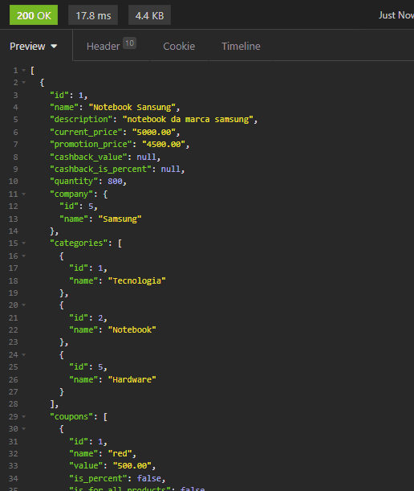

<hr>
<p>Body ⬇️</p>

```
{
	"selector": {
		"fields": [
			"name"
		]
	}
}
```

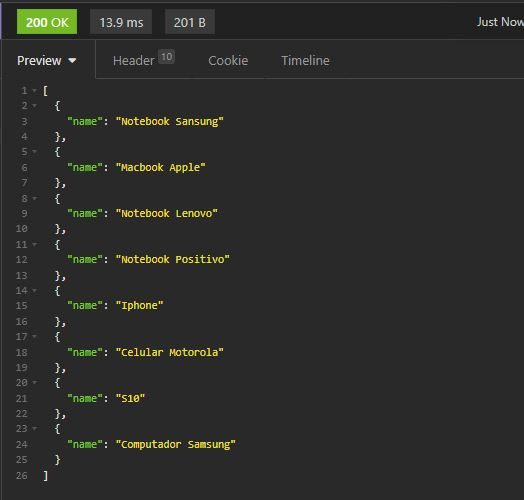
<br>

<hr>
<p>Body ⬇️</p>

```
{
	"selector": {
		"fields": [
			"name",
			"ratings"
		]
	}
}
```

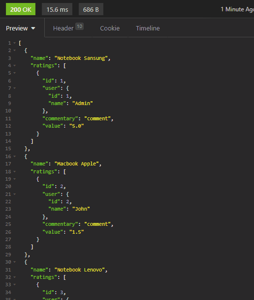
<br>
<hr>
<h3>Para selecionar campos de um relacionamento seja FK, m2m, m2o. Body ⬇️</h3>

```
{
	"selector": {
		"fields": [
			"name",
			"ratings"
		],
		"relationship_fields": {
			"ratings": [
				"value"
			]
		}
	}
}
```

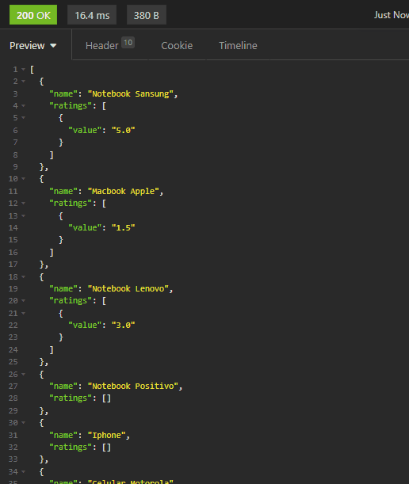
<br>
<h2>Fazendo filtros</h2>
<p>
Todas as queries de um dicionário formam uma operação AND, já dicionários dentro de uma lista fazem operações OR
</p>
<hr>
<h3>Filtro simples. Body ⬇️</h3>
<p>Com mediador, assim você não precisa especificar a query</p>

```
{
	"filters": [
		{
			"name": "notebook"
		}
	],
	"selector": {
		"fields": [
			"name"
		]
	}
}
```

<p>Sem mediador</p>

```
{
	"filters": [
		{
			"name__startwith": "notebook"
		}
	],
	"selector": {
		"fields": [
			"name"
		]
	}
}
```


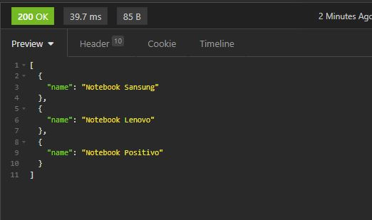
<br>


<hr>
<p>AND OPERATION. Body ⬇️</p>

```
{
	"filters": [
		{
			"name": "notebook",
			"price_gte": 2000
		}
	],
	"selector": {
		"fields": [
			"name"
		]
	}
}
```

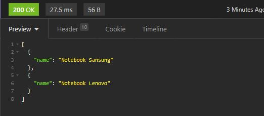
<br>

<hr>
<p>OR OPERATION. Body ⬇️</p>

```
{
	"filters": [
		{
			"name": "notebook"
		},
		{
			"company": "samsung"
		}
	],
	"selector": {
		"fields": [
			"name"
		]
	}
}
```

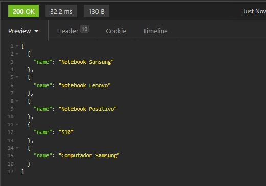
<br>

<h2>Models</h2>
<p>Modelos servem apenas para otimizadas consultas padrões</p>

<h3>Selector</h3>

```

{
    "selector_model": "list"
}

// Equal ⬇️

{
    "selector": {
        "fields": [
            "name",
            "current_price",
            "promotion_price",
            "cashback_value",
            "cashback_is_percent",
            "ratings",
            "categories",
        ],
        "relationship_fields": {
            "ratings": [
                "value",
            ],
            "categories": [
                "name"
            ]
        }
    }
}
```

<h3>Filtro</h3>

```
{
    "filters_model": "promotion"
}

// Equal ⬇️

{
    "filters": [
        {
            "not_has_promotion": False
        }
    ]
}

```

<br>
<br>
<h2>Validação</h2>
<br>
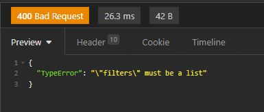
<br>
<br>
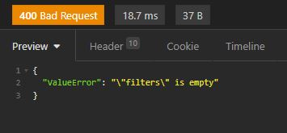
<br>
<br>
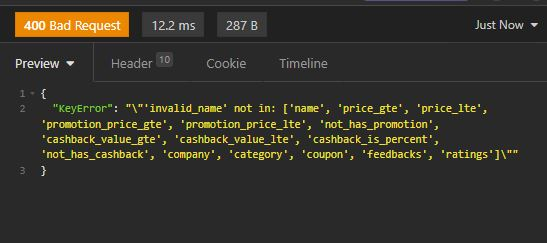
<br>
<br>
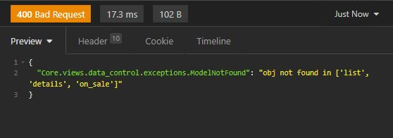
<br>
<br>
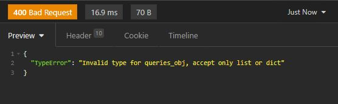
<br>


<br>
<h2 id="use">Como usar na sua máquina</h2>

<h3>Depois de clonar o projeto basta apenas seguir os comandos abaixo.</h3>
<br>

```
python -m venv venv
venv/Scripts/Activate.ps1 # if use PowerShell
cd project
python manage.py runserver
```